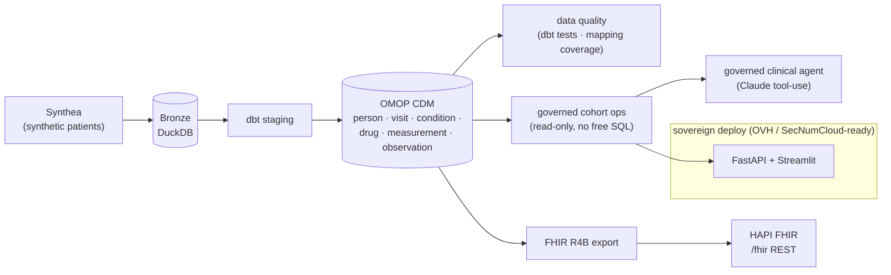

# synthea-to-omop-fhir

> A **governed, sovereign health-data pipeline**: synthetic patients → **OMOP CDM**
> (research) → **FHIR** (interoperability), with data-quality checks and a
> **governed clinical AI agent**. Zero real data, zero RGPD.


-1F6FEB)

Portfolio project demonstrating **health-data engineering** on the two standards
that matter in a French *Entrepôt de Données de Santé* (EDS): **OMOP CDM** (OHDSI,
reproducible research) and **FHIR** (HL7, interoperability) — built on **Synthea**
synthetic patients, with the software rigor (tests, CI, containers) and the
**governance/sovereignty** awareness (RGPD, HDS, SecNumCloud) health teams require.

## Architecture



Full rationale in [`docs/architecture.md`](docs/architecture.md).

## The two standards, in one line each

- **OMOP CDM** (OHDSI): a common schema + standard vocabularies so any health
  dataset is queried the same way → reproducible, multi-center research.
- **FHIR** (HL7, R4B): REST resources (`Patient`, `Encounter`, `Condition`,
  `Observation`…) → the interoperability lingua franca.
- **Synthea**: open-source synthetic patient generator → realistic but fake data.

## Governed clinical AI

On patient data the rule is **no free-form SQL**. The AI agent answers clinical
questions by selecting a **governed cohort operation + parameters** (validated,
read-only, parameterized) — it never writes SQL and never sees raw rows. It even
self-corrects on clinical terminology:

```
$ make ask Q="Combien de patientes ont un cancer du sein ?"
 · cohort_by_condition({'term': 'breast cancer'})               -> 0 patients
 · cohort_by_condition({'term': 'malignant neoplasm of breast'}) -> 26 (24 F / 2 M)
"24 patientes ont un diagnostic de cancer du sein (données synthétiques)."
```

## Quickstart

Requires [uv](https://docs.astral.sh/uv/). Synthea needs Java — or generate it on
**Google Colab** (Java preinstalled) and unzip into `data/synthea/`.

```bash
make setup                       # uv sync
# generate patients: locally (make synthea, needs Java) or on Colab -> data/synthea/csv/
make bronze && make omop         # Synthea -> DuckDB -> OMOP CDM (+ 41 dbt tests)
make test                        # 11 pytest tests

make api                         # cohort API      -> http://localhost:8000/docs
make dashboard                   # cohort explorer -> http://localhost:8501
make ask Q="Top 10 conditions?"  # governed clinical agent (needs ANTHROPIC_API_KEY)

make fhir-export && make fhir-server && make fhir-push   # OMOP -> FHIR -> HAPI
```

One command for the whole stack (API + dashboard + HAPI FHIR):

```bash
docker compose up --build        # or: make docker-up
```

Run `make help` to see every target.

## Vocabulary mapping

The OMOP structure is built faithfully with source codes preserved; standard
`concept_id` mapping is isolated as a separate step (OHDSI vocabulary / Athena),
with a **mapping-coverage** metric — see [`docs/omop_mapping.md`](docs/omop_mapping.md).

**Planned extension — LLM/RAG mapping assistant.** A RAG over the OHDSI vocabulary
subset to *suggest* standard `concept_id`s for unmapped source codes, with
human-in-the-loop validation (the approach of OHDSI's **Usagi** and the LLM tool
**Llettuce**) and a benchmark against Usagi. This fills the `concept_id = 0` gap
while showcasing governed RAG on a real domain problem.

## Testing & quality

- **11 pytest** tests: agent allow-list, tool rejection, FHIR R4B validation, and
  cohort/agent integration (they *skip* cleanly if the warehouse isn't built).
- **41 dbt tests**: primary keys, referential integrity to `person`, accepted
  concept values. CI runs lint + tests on every push.

## Governance & sovereignty

Health data by design: **100% synthetic**, minimisation, pseudonymisation,
least-privilege read-only access, **no free SQL on patient data**, traceability.
Deployment targets a **sovereign** cloud (OVH/Scaleway, SecNumCloud-ready),
aligned with the French HDS → sovereign-cloud shift. See
[`docs/governance_rgpd_hds.md`](docs/governance_rgpd_hds.md) and
[`docs/deployment_sovereign.md`](docs/deployment_sovereign.md).

## Roadmap

- [x] Scaffold (uv, structure, config, architecture)
- [x] Synthea → Bronze (DuckDB)
- [x] dbt: Synthea → OMOP CDM + data-quality tests
- [x] OMOP → FHIR R4B export + HAPI FHIR server
- [x] Governed cohort ops + clinical AI agent + API/dashboard
- [x] Docker + CI + governance & sovereign-deployment docs
- [ ] LLM/RAG concept-mapping assistant (Usagi/Llettuce-style)

## What this demonstrates

Health-data engineering (Synthea → **OMOP CDM** → **FHIR**), data quality (dbt +
mapping coverage), **safe agentic AI on patient data** (governed cohort ops, no
SQL), plus solid practices: uv, Docker/Colima, self-documenting Makefile, CI, a
tested codebase, and a **sovereign** deployment path.

## License

MIT.
