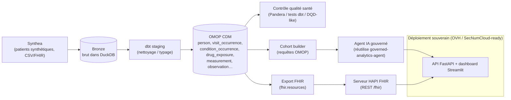

# Architecture — synthea-to-omop-fhir

## Vue d'ensemble

Un pipeline de données de santé **gouverné** et **souverain** qui parle les deux
standards clés des Entrepôts de Données de Santé (EDS) :

- **OMOP CDM** (OHDSI) pour la **recherche / analytique** reproductible ;
- **FHIR** (HL7) pour l'**interopérabilité / échange**.

Le tout à partir de **Synthea** (patients synthétiques → zéro RGPD), avec contrôle
qualité, une couche IA gouvernée, et un chemin de déploiement **cloud souverain**.

## Pourquoi ces choix (angle entretien)

| Choix | Justification |
|---|---|
| **OMOP CDM** | Standard OHDSI : range toute donnée de santé dans un schéma commun + vocabulaires → études **reproductibles et multicentriques**. Le langage des EDS. |
| **FHIR (HL7)** | Standard d'**interopérabilité** : ressources REST (`Patient`, `Encounter`, `Condition`…). Complète OMOP (recherche) par l'échange. |
| **Synthea** | Données **synthétiques** réalistes → démontrable publiquement, **zéro RGPD**, reproductible. |
| **DuckDB** (démo) / **PostgreSQL** (prod) | DuckDB : entrepôt in-process, clone-and-run. PostgreSQL : backend EDS classique (documenté). |
| **dbt** | Transformations Synthea→OMOP versionnées, testées, documentées (ELT). |
| **Pandera / tests dbt** | Qualité **health-grade** : contraintes métier, cohérence des vocabulaires, intégrité. |
| **fhir.resources** | Construit/valide des ressources FHIR conformes (R4) en Python. |
| **HAPI FHIR** | Serveur FHIR de référence (Java, via Docker) pour exposer les ressources. |
| **Cloud souverain (OVH)** | Aligné avec la bascule HDS → SecNumCloud (Cloud Act / loi SREN). |

## Couches (Medallion adapté santé)

1. **Bronze** — Synthea brut chargé dans DuckDB (aucune transformation).
2. **Silver (staging dbt)** — nettoyage, typage, harmonisation.
3. **Gold (OMOP CDM)** — tables OMOP standard + contrôle qualité.
4. **Serving** — FHIR (interopérabilité) + cohortes + agent IA gouverné + API/dashboard.

## Gouvernance (fil rouge)

RGPD / HDS / secret médical pris en compte *by design* : données 100 % synthétiques,
pseudonymisation documentée, traçabilité, finalités explicites. Voir
[`governance_rgpd_hds.md`](governance_rgpd_hds.md).
