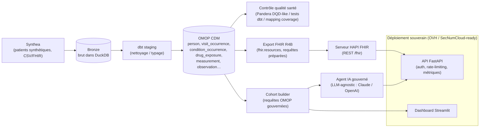
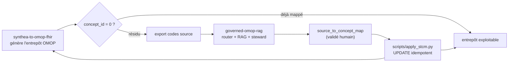

# Architecture — synthea-to-omop-fhir

## Vue d'ensemble

Un pipeline de données de santé **gouverné**, **souverain**, et **production-ready**
qui parle les deux standards clés des Entrepôts de Données de Santé (EDS) :

- **OMOP CDM** (OHDSI) pour la **recherche / analytique** reproductible ;
- **FHIR** (HL7) pour l'**interopérabilité / échange**.

Le tout à partir de **Synthea** (patients synthétiques → zéro RGPD), avec
contrôle qualité Pandera DQD-like, une **API FastAPI robuste** (auth, rate-limiting,
métriques Prometheus), et une **couche IA gouvernée** (LLM-agnostic : Claude / OpenAI).
Déploiement cible : **cloud souverain** (OVH, SecNumCloud-ready).

---

## Production-ready upgrades (8 étapes)

Le projet a été durci via un plan incrémental documenté dans
`audit_projet/progress.txt`.

### 1. Sécurité SQL — requêtes préparées
- **Fichier** : `synthea_omop_fhir/fhir/export.py`
- **Problème** : interpolation Python dans les requêtes SQL (`person_id IN ({ph})`).
- **Correction** : passage à des paramètres préparés DuckDB
  (`person_id IN (SELECT UNNEST(?))`) avec liste d'IDs typée en `BIGINT`.
- **Impact** : élimine le risque d'injection SQL sur l'export FHIR.

### 2. Module qualité — Pandera DQD-like
- **Fichier** : `synthea_omop_fhir/quality/run.py`
- **Scope** : validations health-grade sur les tables OMOP
  - Schéma (types, nullabilité, domaines de valeurs)
  - Cohérence temporelle (`death_after_birth`, `visit_end_after_start`,
    `condition_end_after_start`, `drug_end_after_start`)
  - Valeurs physiques positives (`measurement_positive_value`)
  - **Couverture de mapping** : ratio de `concept_id = 0` par table
    (`person`, `visit_occurrence`, `condition_occurrence`, `drug_exposure`,
    `measurement`, `procedure_occurrence`, `observation`)
- **Sortie** : rapport JSON pass/fail avec détails par check.
- **Usage** : `uv run python -m synthea_omop_fhir.quality.run`

### 3. API robuste — FastAPI hardening
- **Fichiers** : `synthea_omop_fhir/api/main.py`, `errors.py`, `dependencies.py`
- **Features** :
  - **Auth** : clé API via header `X-API-Key` (désactivable quand vide)
  - **Pagination** : `offset` / `limit` avec clamp à 1000
  - **Rate limiting** : token bucket par IP, désactivable via `RATE_LIMIT_PER_MINUTE=0`
  - **Gestion d'erreurs** : handlers globaux (`APIError`, `UnauthorizedError`,
    `WarehouseNotFoundError`, `RequestValidationError`, catch-all 500)
  - **Middleware** : correlation ID (`X-Correlation-Id`) injecté dans les logs
  - **Endpoints** :
    - `GET /health` — statut + `db_latency_ms` + version
    - `GET /ready` — probe readiness (warehouse existante ?)
    - `GET /metrics` — exposition Prometheus
    - `GET /quality` — rapport qualité Pandera
    - `GET /cohort/prevalence`, `/cohort/condition` — cohortes gouvernées
- **Tests** : `tests/test_api.py` (auth, rate-limit, pagination, error handlers)

### 4. Agent LLM provider-agnostic
- **Fichier** : `synthea_omop_fhir/agent/llm.py`
- **Abstraction** : interface `LLMClient` avec deux implémentations :
  - `AnthropicClient` (Claude 3 Sonnet via `anthropic` SDK)
  - `OpenAIClient` (GPT-4o via `openai` SDK)
- **Factory** : `create_llm_client()` sélectionne le provider selon la variable
  d'environnement `LLM_PROVIDER` (`anthropic` | `openai`).
- **Backward compat** : mock `FakeLLMClient` pour les tests offline.
- **Tests** : `tests/test_llm.py` (factory, adapter, timeout)

### 5. Observabilité — logging, métriques, health checks
- **Fichiers** : `synthea_omop_fhir/logging_config.py`, `api/metrics.py`
- **Structured logging** : format JSON avec `timestamp`, `level`, `logger`,
  `correlation_id`, `message` — activé en prod (`LOG_FORMAT=json`).
- **Prometheus metrics** (`prometheus-client`) :
  - `api_requests_total` — compteur par endpoint/méthode/status
  - `api_request_duration_seconds` — histogramme de latence
  - `api_errors_total` — compteur d'erreurs
- **Health checks** :
  - `/health` → `{"status":"ok","patients":1158,"db_latency_ms":13.75,"version":"0.2.0"}`
  - `/ready` → 200 si warehouse présente, 503 sinon
- **Tests** : `tests/test_logging.py` (JSON formatter)

### 6. Configuration demo / prod — DuckDB vs PostgreSQL
- **Fichier** : `synthea_omop_fhir/db.py`
- **Factory** : `get_connection()` sélectionne le backend selon `DB_PROVIDER`
  (`duckdb` | `postgres`).
- **DuckDB** (démo / local) : fichier `.duckdb`, pas de serveur.
- **PostgreSQL** (prod) : connection string `POSTGRES_URI`, pool géré par
  `psycopg2` / `sqlalchemy`.
- **Usage** : toutes les couches (`cohort/`, `quality/`, `fhir/export.py`,
  `load_bronze.py`) utilisent la factory, jamais de connexion hardcodée.
- **Tests** : `tests/test_db.py` (factory, mock Postgres, erreurs)

### 7. Infrastructure as Code — Terraform OVH + Docker Compose prod
- **Terraform** (`infra/terraform/`) :
  - `providers.tf` — provider OVH OpenStack
  - `variables.tf` — paramètres (flavor, image, region)
  - `main.tf` — instance compute + réseau + DB managée PostgreSQL
  - `user-data.sh` — bootstrap Docker + docker-compose
- **Docker Compose prod** (`docker-compose.prod.yml`) :
  - API FastAPI (image buildée, Gunicorn + Uvicorn workers)
  - PostgreSQL (ou connexion à la DB managée OVH)
  - HAPI FHIR server
  - nginx (reverse proxy, TLS)
- **Docs** : `docs/deployment_sovereign.md`

### 8. Tests couverture — 61 %
- **Fichiers de test** ajoutés / enrichis :
  - `tests/test_api.py` — auth, rate-limit, warehouse guard, error handlers
  - `tests/test_db.py` — factory, mock connection, erreurs
  - `tests/test_fhir.py` — `_iso()`, `_validated()`, `build_bundle()` avec fake
    connection
  - `tests/test_llm.py` — factory LLM, adapter messages
  - `tests/test_logging.py` — JSON formatter
  - `tests/test_quality.py` — Pandera schema validation
- **Résultats** (avant → après) :
  | Module | Avant | Après | Δ |
  |---|---|---|---|
  | `api/dependencies.py` | 54 % | 78 % | +24 % |
  | `db.py` | 61 % | 89 % | +28 % |
  | `fhir/export.py` | 37 % | 70 % | +33 % |
  | `api/errors.py` | 76 % | 90 % | +14 % |
  | **TOTAL** | **54 %** | **61 %** | **+7 %** |
- **CI** : `ruff check .` + `pytest` sur chaque push.

---

## Pourquoi ces choix (angle entretien)

| Choix | Justification |
|---|---|
| **OMOP CDM** | Standard OHDSI : range toute donnée de santé dans un schéma commun + vocabulaires → études **reproductibles et multicentriques**. Le langage des EDS. |
| **FHIR (HL7 R4B)** | Standard d'**interopérabilité** : ressources REST (`Patient`, `Encounter`, `Condition`…). Complète OMOP (recherche) par l'échange. |
| **Synthea** | Données **synthétiques** réalistes → démontrable publiquement, **zéro RGPD**, reproductible. |
| **DuckDB** (démo) / **PostgreSQL** (prod) | DuckDB : entrepôt in-process, clone-and-run. PostgreSQL : backend EDS classique (documenté). Switch via `DB_PROVIDER`. |
| **dbt** | Transformations Synthea→OMOP versionnées, testées, documentées (ELT). |
| **Pandera** | Validation **programmatique** des tables OMOP (schéma, cohérence, couverture) — complémentaire aux tests dbt. |
| **fhir.resources** | Construit/valide des ressources FHIR conformes (R4B) en Python. |
| **HAPI FHIR** | Serveur FHIR de référence (Java, via Docker) pour exposer les ressources. |
| **FastAPI + Prometheus** | API moderne, async, avec métriques et health checks — pattern cloud-native. |
| **Cloud souverain (OVH)** | Aligné avec la bascule HDS → SecNumCloud (Cloud Act / loi SREN). |

---

## Couches (Medallion adapté santé)

1. **Bronze** — Synthea brut chargé dans DuckDB (aucune transformation).
2. **Silver (staging dbt)** — nettoyage, typage, harmonisation.
3. **Gold (OMOP CDM)** — tables OMOP standard + contrôle qualité Pandera.
4. **Serving** — FHIR (interopérabilité) + cohortes gouvernées + agent IA +
   API FastAPI (auth, métriques) + dashboard Streamlit.

---

## Boucle RAG — combler les `concept_id = 0`

Le maillon manquant du pipeline est le **mapping des codes source vers les
concepts standard OHDSI**. [`governed-omop-rag`](https://github.com/behramkorkut/governed-omop-rag)
produit un `source_to_concept_map` validé par un steward humain ; ce repo le
réinjecte via `scripts/apply_stcm.py` pour remplacer les `concept_id = 0`.

Détail complet : [`docs/rag_integration.md`](docs/rag_integration.md).

---

## Gouvernance (fil rouge)

RGPD / HDS / secret médical pris en compte *by design* : données 100 % synthétiques,
pseudonymisation documentée, traçabilité, finalités explicites, **pas de SQL libre
sur les données patient**. Voir [`governance_rgpd_hds.md`](governance_rgpd_hds.md).
