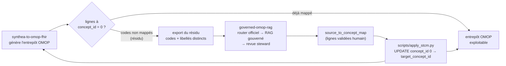

# Intégration RAG — boucle de réinjection OMOP

> Ce document décrit comment le projet frère
> [`governed-omop-rag`](https://github.com/behramkorkut/governed-omop-rag)
> comble le trou des `concept_id = 0` dans l'entrepôt OMOP produit par
> `synthea-to-omop-fhir`.

## Le problème

`synthea-to-omop-fhir` construit fidèlement la structure OMOP en préservant les
codes source, mais isole le mapping vers les `concept_id` **standard OHDSI**
(`standard_concept = 'S'`) en une étape à part. Les codes non mappés écrivent la
valeur sentinelle **`concept_id = 0`** (« No matching concept »).

Ces `concept_id = 0` :
- cassent la comparabilité multicentrique (une cohorte sur SNOMED ne « voit » pas
  les lignes à 0) ;
- doivent être résolus manuellement, ce qui est coûteux.

## La solution : RAG agentique gouverné

[`governed-omop-rag`](https://github.com/behramkorkut/governed-omop-rag) est un
pipeline de mapping **CIM-10 FR → concepts standard OHDSI** (SNOMED-CT, RxNorm,
LOINC…) avec les garanties suivantes :

- **Router déterministe d'abord** — alignement officiel ATIH/OHDSI 1-à-1
  (31,8 % des codes, 100 % précis, gratuit).
- **RAG agentique sur le résidu** — retrieval hybride BM25 + BioLORD dense +
  fusion RRF, puis agent Proposer + Vérificateur (Claude/OpenAI).
- **Human-in-the-loop** — steward valide / corrige / rejette chaque suggestion
  dans une UI Streamlit.
- **Sortie fermée** — `target_concept_id` provient toujours du référentiel OHDSI
  (`standard_concept = 'S'`), jamais inventé.
- **Traçabilité** — chaque décision est journalisée avec source, confiance et
  feedback steward.

Résultats mesurés sur gold set réel ATIH (80 conditions, résidu held-out) :
- Top-1 : **65 %** (contre 41 % sans LLM)
- Recall@5 : **70 %**
- Coût : ~0,005 $/code

## Le contrat d'échange : `source_to_concept_map` (STCM)

Le seul contrat entre les deux projets est une **table OMOP standard** :
`source_to_concept_map`. Elle est produite par `governed-omop-rag` après
validation steward et ne contient que des lignes humainement validées.

| Colonne | Rôle |
|---|---|
| `source_code` | code d'origine (ex. code CIM-10 FR) |
| `source_vocabulary_id` | vocabulaire source (`ICD10_FR`, `CCAM`, …) |
| `source_code_description` | libellé source lisible |
| `target_concept_id` | concept standard OHDSI retenu |
| `target_vocabulary_id` | vocabulaire cible (`SNOMED`, `RxNorm`, …) |
| `valid_start_date` / `valid_end_date` | fenêtre de validité |
| `invalid_reason` | `NULL` = actif |

## La boucle de bout en bout



Étapes :

1. **Détecter le résidu** — lister les codes source distincts dont le
   `concept_id` standardisé vaut `0`.
2. **Mapper le résidu** — passer ces codes dans `governed-omop-rag`
   (batch API `/map/batch`, ou UI Streamlit).
3. **Valider** — le steward accepte / corrige / rejette. Rien n'est exporté
   sans décision humaine.
4. **Exporter le STCM** — `source_to_concept_map.csv` au schéma OMOP.
5. **Réinjecter** — `scripts/apply_stcm.py` charge le STCM et remplace les
   `concept_id = 0` par les `target_concept_id` validés.
6. **Boucler** — au prochain run, le résidu a diminué.

## Extraction du résidu (SQL)

```sql
-- Codes source distincts non standardisés (condition_occurrence)
SELECT DISTINCT
    condition_source_value          AS source_code,
    'ICD10_FR'                      AS source_vocabulary_id,
    condition_source_value          AS source_code_description
FROM condition_occurrence
WHERE condition_concept_id = 0
  AND condition_source_value IS NOT NULL;

-- Même motif pour drug_exposure, measurement, procedure_occurrence, observation
```

Export CSV → entrée de `governed-omop-rag`.

## Réinjection avec `scripts/apply_stcm.py`

Après avoir produit `source_to_concept_map.csv` (côté RAG) :

```bash
uv run python scripts/apply_stcm.py \
  --stcm data/source_to_concept_map.csv \
  --db data/omop.duckdb
```

Le script :
- charge le STCM dans DuckDB ;
- fait un `UPDATE` idempotent sur chaque table domaine
  (`condition_occurrence`, `drug_exposure`, `measurement`,
  `procedure_occurrence`, `observation`) ;
- recompile la métrique de **couverture** (ratio de `concept_id = 0` restants) ;
- affiche un résumé des lignes mises à jour.

## Garanties de gouvernance

- **Rien d'automatique côté clinique.** Seules des lignes validées par un humain
  entrent dans le STCM.
- **Sortie fermée.** `target_concept_id` provient toujours d'un concept réel du
  référentiel OHDSI (`standard_concept = 'S'`).
- **Traçabilité.** Chaque ligne STCM porte sa source, ses dates de validité et
  le feedback steward.
- **Idempotence.** Rejouer la réinjection avec le même STCM ne change rien.
- **Découplage.** Le format d'échange est du STCM OMOP standard — n'importe quel
  pipeline peut consommer la sortie.

## Références

- [`governed-omop-rag`](https://github.com/behramkorkut/governed-omop-rag) — repo
  du projet frère (RAG agentique gouverné, 92 % coverage)
- [`docs/reinjection.md`](https://github.com/behramkorkut/governed-omop-rag/blob/main/docs/reinjection.md)
  — documentation détaillée côté RAG
- [`docs/evaluation.md`](https://github.com/behramkorkut/governed-omop-rag/blob/main/docs/evaluation.md)
  — métriques et benchmark ATIH
